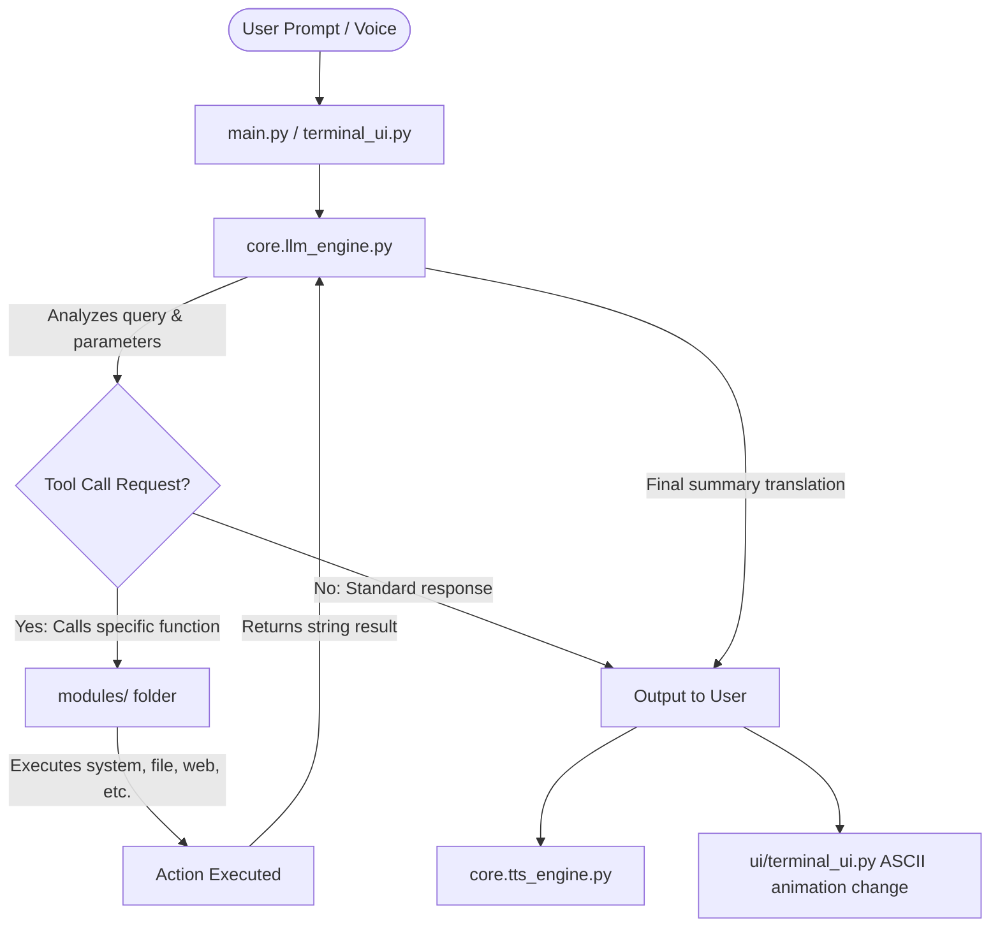

<<<<<<< HEAD
#                    VISION AI ASSISTANT                    
#            Advanced AI Desktop Assistant v1.0              

=======
# ╔═══════════════════════════════════════════════════════════╗
# ║                    VISION AI ASSISTANT                    ║
# ║           Advanced AI Desktop Assistant v1.0              ║
# ╚═══════════════════════════════════════════════════════════╝
>>>>>>> 26e9256 (feat: add programmatic web surfing and cross-platform Linux support)

<p align="center">
  
  
  
  
</p>

---

## 🌌 The Inception

**VISION** is an agentic, multi-modal AI desktop assistant designed to act as your digital companion, automator, and knowledge engine. It represents a unique fusion of two iconic MCU concepts:

*   **🧠 Named after Vision (MCU):** Emulating the synthezoid born from JARVIS, Ultron, and the Mind Stone. The assistant is polite, highly logical, calm under pressure, and possesses extensive analytical knowledge, helping you compose code, draft files, plan schedules, and retrieve web data.
*   **🖥️ Inspired by M.O.D.O.K. (MCU):** Visually stylized after the **M.O.D.O.K.** chassis (Mental Organism Designed Only for Killing)—adapted here as a **Mental Organism Designed Only for Keyboard and Kinetic Automation**. The entire interface centers around a giant, animated, high-resolution ASCII head encased in a cybernetic scanning terminal HUD. When VISION listens, thinks, speaks, or stands by, this digital face pulses, sweeps, glitches, and emotes in real-time.

---

## 🚀 Key Features & Capabilities

VISION is equipped with **20+ capabilities** broken down into modular control subsystems:

### 🎙️ Speech & Activation
*   **Wake Word Detection:** Listen in the background for the activation phrase `"vision online"`.
*   **Global Hotkey Toggle:** Press `Ctrl+Alt+V` to instantly prompt voice listening.
*   **Microphone Diagnostics:** Interactive microphone calibration and status reports.
*   **TTS Responses:** Smart, concise text-to-speech output with natural phrasing.

### 🎛️ System & Kinetic Controls
*   **Volume Adjustment:** Command volume up, down, mute, or set exact levels.
*   **Brightness Controller:** Set monitor brightness or step it incrementally.
*   **Media Playback:** Control system media state (Play/Pause, Next Track, Previous Track).
*   **Virtual Typing:** Type passages on behalf of the user using keystroke simulation.

### 📁 File Management & OS Navigation
*   **File Search:** Fast search of files and folders in specified paths or system-wide.
*   **Directory Listing:** Print structured folder listings.
*   **Document & Media Launcher:** Command VISION to open movies, PDFs, photos, and general files.
*   **Registry-Based App Launcher:** Quick launch capability for 20+ preset desktop applications (Notepad, Chrome, Spotify, Discord, VSCode, Excel, etc.) with automatic Start Menu shortcut searching as fallback.

### 🌐 Web & Communications
<<<<<<< HEAD
*   **Search Engines:** Query Google, Wikipedia, or run general web requests.
=======
*   **Programmatic Web Surfing & Search:** Perform DuckDuckGo searches and read webpage content directly inside the terminal (enables VISION to surf the internet and digest information without spawning browser windows).
*   **Browser Integrations:** Open target websites in default or Brave browser.
>>>>>>> 26e9256 (feat: add programmatic web surfing and cross-platform Linux support)
*   **Media Streaming:** Query YouTube videos or play specific music on YouTube/YT Music.
*   **Real-time Information:** Pull current weather data, live news topics, and compare prices across e-commerce listings.
*   **WhatsApp Automation:** Send messages to registered contacts via WhatsApp Web.
*   **SMTP Emails:** Dispatch email updates through a secure SMTP configuration.

### 📔 Productivity & Logic
*   **Notes Database:** Complete CRUD notes management with text search capability.
*   **Project Planner:** Task scheduler supporting plan creation, task indexing, and completion status.
*   **Knowledge Engine:** Explain complex concepts, write customized study/learning paths, and generate functional code scripts using local Ollama LLM capabilities.

---

## 📂 Project Structure

```bash
ollama-wrapper-vision/
├── core/
│   ├── __init__.py
│   ├── llm_engine.py       # Ollama chat wrapper & function tool definitions
│   ├── stt_engine.py       # Speech recognition & wake word detection
│   └── tts_engine.py       # pyttsx3 text-to-speech configuration
├── modules/
│   ├── __init__.py
│   ├── app_launcher.py     # Windows Registry & Start Menu application locator
│   ├── code_generator.py   # LLM powered code writing agent
│   ├── file_browser.py     # OS file searching & directory listings
│   ├── knowledge.py        # Explaining complex concepts and study plans
│   ├── messaging.py        # WhatsApp (pywhatkit) and Email (smtplib) dispatchers
│   ├── notes_module.py     # JSON-backed note manager (CRUD)
│   ├── planner.py          # Plan scheduler and task runner
│   ├── screenshot_module.py# Pillow & PyAutoGUI screenshot capturing
│   ├── system_control.py   # volume, brightness (screen-brightness-control), media keys
│   ├── typing_module.py    # PyAutoGUI automated typing
│   ├── web_browser.py      # Website launches, Google & Image searches
│   ├── web_search.py       # API calls for weather, news RSS, e-commerce pricing
│   └── youtube_module.py   # Web browser searches and YT Music integrations
├── startup/
│   ├── __init__.py
│   └── install_startup.py  # Registry helper to run VISION on Windows startup
├── ui/
│   ├── __init__.py
│   ├── ascii-art.txt       # The high-resolution mechanical M.O.D.O.K. face art
│   ├── ascii_face.py       # Animation engine (idle, listening, thinking, speaking, sleeping)
│   └── terminal_ui.py      # Cyberpunk layout dashboard using Rich library
├── data/                   # JSON data directories (created on startup)
│   ├── notes.json
│   ├── plans.json
│   └── contacts.json
├── config.py               # Path definitions, theme colors, system prompts
├── main.py                 # Core orchestration thread, event loops, CLI args
├── test_vision.py          # Unified suite checking all 13 modules
<<<<<<< HEAD
=======
├── test_surfing.py         # Verification check for web search and page scraping
>>>>>>> 26e9256 (feat: add programmatic web surfing and cross-platform Linux support)
├── requirements.txt        # Package dependencies
└── .env                    # Secret keys and custom system paths
```

---

## 🛠️ Installation & Setup

### 1. Prerequisites
- **Python 3.11 or later** is highly recommended.
- **Ollama:** Install Ollama on your system:
  - Download from: [https://ollama.com](https://ollama.com)
  - Start the Ollama server.
  - Pull the default brain model:
    ```bash
    ollama pull phi3:mini
    ```

### 2. Clone and Setup Environment
Navigate to the directory and set up a virtual environment:
```bash
# Initialize virtual environment
python -m venv .venv

# Activate virtual environment
# On Linux/macOS:
source .venv/bin/activate
# On Windows:
.venv\Scripts\activate
```

### 3. Install Dependencies
```bash
pip install -r requirements.txt
```

> [!NOTE]
> On Windows, some packages (such as `pywin32` or `PyAudio`) are handled automatically, but if you encounter PyAudio install issues on Linux, install the system-level development packages first: `sudo apt install portaudio19-dev python3-pyaudio`.

### 4. Configure Environment Variables (`.env`)
Create a `.env` file in the root directory based on the `.env.example` template:
```env
# Ollama Configuration
OLLAMA_BASE_URL=http://localhost:11434
OLLAMA_MODEL=phi3:mini

# System Paths (Configure for your browser)
BRAVE_PATH=C:\Program Files\BraveSoftware\Brave-Browser\Application\brave.exe

# Email Configuration (Optional - for sending emails)
EMAIL_ADDRESS=your-email@gmail.com
EMAIL_PASSWORD=your-app-password
EMAIL_SMTP_SERVER=smtp.gmail.com
EMAIL_SMTP_PORT=587

# Weather API Key (Optional - from OpenWeatherMap)
OPENWEATHER_API_KEY=your_openweather_key
WEATHER_CITY=Delhi
```

---

## 🕹️ Usage

To start VISION, run the main orchestration file:

```bash
# Standard mode (Voice + Terminal UI)
python main.py

# Text-only mode (No voice input/output)
python main.py --no-voice
```

### 🤖 Keyboard Commands & Sidebar
Once the dashboard boots, you will see the animated M.O.D.O.K.-style face panel and log feed. You can directly write queries or invoke special meta commands:

*   `help` — Toggles the side commands/meta help overlay.
*   `voice` — Manually launches voice capture.
*   `voice diagnostics` — Runs speaker/microphone diagnostics and outputs configuration status.
*   `clear` — Resets active conversation logs and clears the LLM memory context.
<<<<<<< HEAD
*   `startup install` — Adds VISION to your Windows Startup registry.
*   `startup uninstall` — Removes VISION from the Windows Startup registry.
=======
*   `startup install` — Adds VISION to your system startup (Windows Startup registry or Linux autostart folder).
*   `startup uninstall` — Removes VISION from the system startup.
>>>>>>> 26e9256 (feat: add programmatic web surfing and cross-platform Linux support)
*   `quit` / `exit` — Shuts down the terminal.

---

## 🧠 System Architecture

VISION leverages **Ollama's local function-calling system** to act as an agentic scheduler:



1.  **Parsing Engine:** User input (voice transcription or console text) is forwarded to the local Ollama instance with configured JSON tool schema definitions.
2.  **Function Calling:** The LLM decides whether it needs to invoke an operating system capability or respond conversationally.
3.  **Action Execution:** `main.py` maps the LLM tool requests directly to Python routines in the `modules/` folder (such as adjusting system sound, starting software, or taking note CRUD actions).
4.  **Loop Feedback:** The result of the action is packaged and fed back into the LLM context. The LLM then speaks and displays a summary report back to the user under a coherent futuristic persona.

---

## 🧪 Running Verification Tests

<<<<<<< HEAD
The project includes an automatic test suite `test_vision.py` that verifies core functionality and checks all modules, configuration files, and state changes:

```bash
python test_vision.py
```

This checks:
=======
The project includes two automatic test suites:
1. `test_vision.py` verifies core assistant functionality, configuration, and module imports:
   ```bash
   python test_vision.py
   ```
2. `test_surfing.py` validates the programmatic web search and webpage scraping:
   ```bash
   python test_surfing.py
   ```

### Core Tests Validate:
>>>>>>> 26e9256 (feat: add programmatic web surfing and cross-platform Linux support)
- ASCII Face (6 distinct animation states)
- Notes CRUD and search mechanics
- Plan creation and task updates
- File listing and search
- App Registry verification (20+ registered apps)
- Tool scheme declarations
- Live API endpoints (Weather, config)
- System imports and execution paths

---

## 👥 Credits & Customization

Developed by **Garvit Prakash**. 

*To change the ASCII art visual face:*
Edit the text blocks inside [ui/ascii-art.txt](file:///mnt/Garvit%20Prakash/VISION/ui/ascii-art.txt) to reflect any desired character, robot face, or console theme. Keep the placeholder symbol `A` in the areas you want the animation engine to animate/flash during state updates!

---
<p align="center">
  <i>"VISION online. All systems nominal."</i>
</p>
