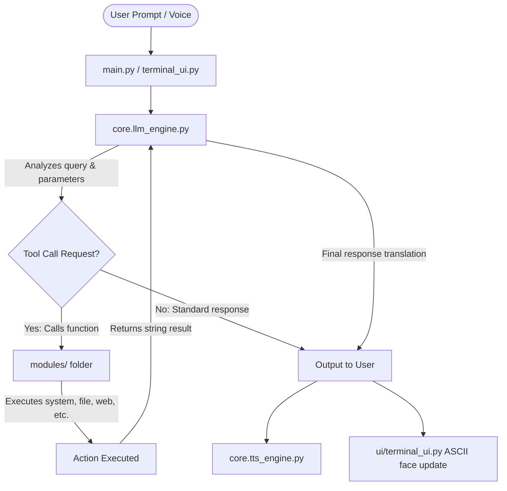

# VISION AI Assistant
### Advanced AI Desktop Assistant v1.0

<p align="center">
  
  
  
  
</p>

---

## 🌌 Overview

**VISION** is an agentic, multi-modal AI desktop assistant designed to function as an autonomous digital companion, system automator, and knowledge engine. The project synthesizes two main concepts:

*   **Logical Synthezoid (VISION):** Emulates a calm, highly logical, and capable persona to assist with coding, system management, and web research.
*   **Keyboard & Kinetic Automation (M.O.D.O.K.):** Encased in a cyberpunk scanning terminal HUD featuring a real-time animated ASCII face that reacts dynamically when the assistant is listening, thinking, speaking, or standby.

---

## 🚀 Key Features

VISION includes a wide array of modular subsystems to control your desktop and retrieve information:

### 🎙️ Speech & Activation
*   **Wake Word Detection:** Background voice activation listening for `"vision online"`.
*   **Global Hotkey Toggle:** Quick activation via `Ctrl+Alt+V`.
*   **Microphone Diagnostics:** Calibration utilities and status reporting.
*   **TTS Responses:** Natural, concise text-to-speech feedback.

### 🎛️ System & Kinetic Controls
*   **Volume & Brightness:** Precise, incremental adjustments to system audio and display brightness.
*   **Media Playback:** System-wide controls for Play/Pause, Next Track, and Previous Track.
*   **Virtual Typing:** Automated keystroke simulation for text entry.

### 📁 File Management & OS Navigation
*   **File Search:** High-performance search for files and folders.
*   **Directory Listing:** Structural outputs of folders.
*   **Application Launcher:** Quick launching for 20+ preset desktop applications with fallback shortcut searching.

### 🌐 Web & Integration
*   **Programmatic Web Surfing:** DuckDuckGo queries and text scraping directly in the terminal, bypassing the need for a full browser instance.
*   **Browser Launching:** Open websites directly in your default browser or Brave.
*   **Media Streaming:** Query and play YouTube/YouTube Music content.
*   **Real-time API Data:** Live updates for weather, RSS news, and e-commerce pricing comparison.
*   **Messaging Automation:** Send messages via WhatsApp Web and dispatch secure SMTP emails.

### 📔 Productivity & Utilities
*   **Notes Manager:** Full JSON-backed CRUD notes database.
*   **Project Planner:** Scheduler supporting task lists and plan management.
*   **Code Generation:** Locally run LLM-based coding assistant.

---

## 📂 Project Structure

```bash
ollama-wrapper-vision/
├── core/
│   ├── __init__.py
│   ├── llm_engine.py       # Ollama chat wrapper & tool definitions
│   ├── stt_engine.py       # Speech recognition & wake word detection
│   └── tts_engine.py       # Text-to-speech configuration
├── modules/
│   ├── __init__.py
│   ├── app_launcher.py     # Application locator & launcher
│   ├── code_generator.py   # LLM code-writing helper
│   ├── file_browser.py     # File search & folder listing
│   ├── knowledge.py        # Explaining concepts & study plans
│   ├── messaging.py        # WhatsApp & email automation
│   ├── notes_module.py     # JSON CRUD notes manager
│   ├── planner.py          # Plan and task scheduler
│   ├── screenshot_module.py# Screenshot utilities
│   ├── system_control.py   # Volume, brightness, & media controls
│   ├── typing_module.py    # Automated keystroke simulation
│   ├── web_browser.py      # Website launches & web searches
│   ├── web_search.py       # Weather, news RSS, & price comparisons
│   └── youtube_module.py   # YouTube & YT Music integration
├── startup/
│   ├── __init__.py
│   └── install_startup.py  # System autostart management
├── ui/
│   ├── __init__.py
│   ├── ascii-art.txt       # Animated face templates
│   ├── ascii_face.py       # Terminal face animation engine
│   └── terminal_ui.py      # Cyberpunk terminal UI using Rich
├── data/                   # JSON state storage
├── config.py               # Global settings & configuration
├── main.py                 # Core orchestration thread
├── test_vision.py          # Main core verification test suite
├── test_surfing.py         # Web surfing verification suite
├── requirements.txt        # Package dependencies
└── .env                    # System configuration & keys
```

---

## 🛠️ Installation & Setup

### 1. Prerequisites
*   **Python 3.11+**
*   **Ollama:** Install Ollama, start the server, and pull the required model:
    ```bash
    ollama pull phi3:mini
    ```
*   **Linux Dependencies:** (If using PyAudio on Linux)
    ```bash
    sudo apt install portaudio19-dev python3-pyaudio
    ```

### 2. Environment Setup
Clone the repository and initialize a virtual environment:
```bash
python -m venv .venv
source .venv/bin/activate  # On Windows: .venv\Scripts\activate
pip install -r requirements.txt
```

### 3. Configuration
Copy `.env.example` to `.env` and set up the environment variables:
```env
OLLAMA_BASE_URL=http://localhost:11434
OLLAMA_MODEL=phi3:mini

# Optional integrations
BRAVE_PATH=C:\Program Files\BraveSoftware\Brave-Browser\Application\brave.exe
EMAIL_ADDRESS=your-email@gmail.com
EMAIL_PASSWORD=your-app-password
WEATHER_CITY=Delhi
```

---

## 🕹️ Usage

Run the main dashboard interface:

```bash
# Standard mode (Voice + Terminal UI)
python main.py

# Text-only mode (No voice input/output)
python main.py --no-voice
```

### ⌨️ Terminal Commands
When running in text mode, you can type prompts or use special commands:
*   `help` — Toggle the side command/meta overlay.
*   `voice` — Manually activate voice capture.
*   `voice diagnostics` — Test the speaker and microphone configurations.
*   `clear` — Reset active conversation logs and LLM memory.
*   `startup install` — Enable launching on system startup.
*   `startup uninstall` — Disable launching on system startup.
*   `quit` / `exit` — Shut down the terminal interface.

---

## 🧠 System Architecture

VISION utilizes Ollama's local function-calling capability to act as an agentic scheduler:



---

## 🧪 Verification Tests

Run the verification test suites to ensure everything is configured correctly:

1.  **Core Module Tests:**
    ```bash
    python test_vision.py
    ```
2.  **Web Surfing Tests:**
    ```bash
    python test_surfing.py
    ```

---

## 👥 Customization
To customize the animated face, edit the templates in `ui/ascii-art.txt`. Keep the placeholder symbol `A` in the regions where you want the scanline and face animations to sweep and emote during status changes.
